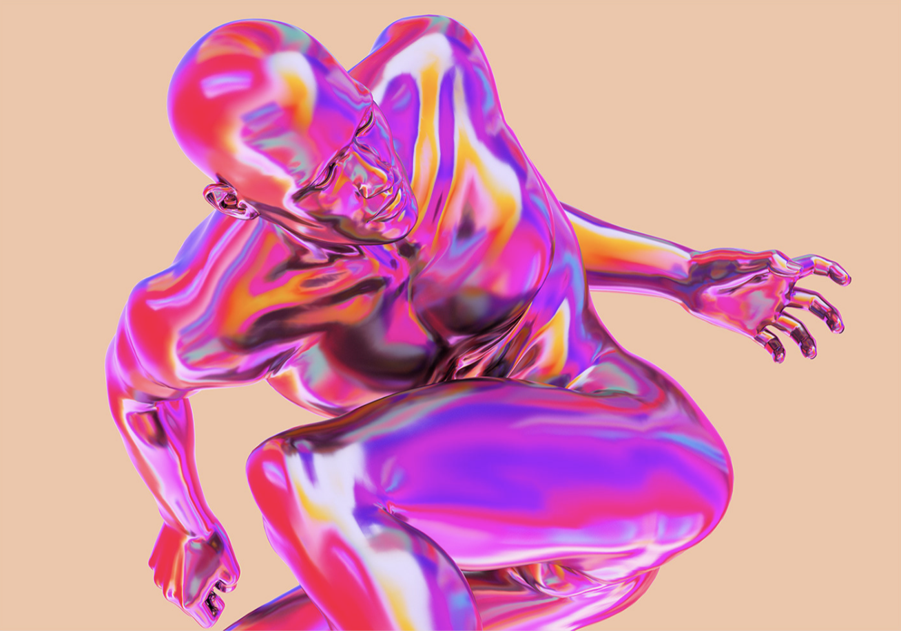
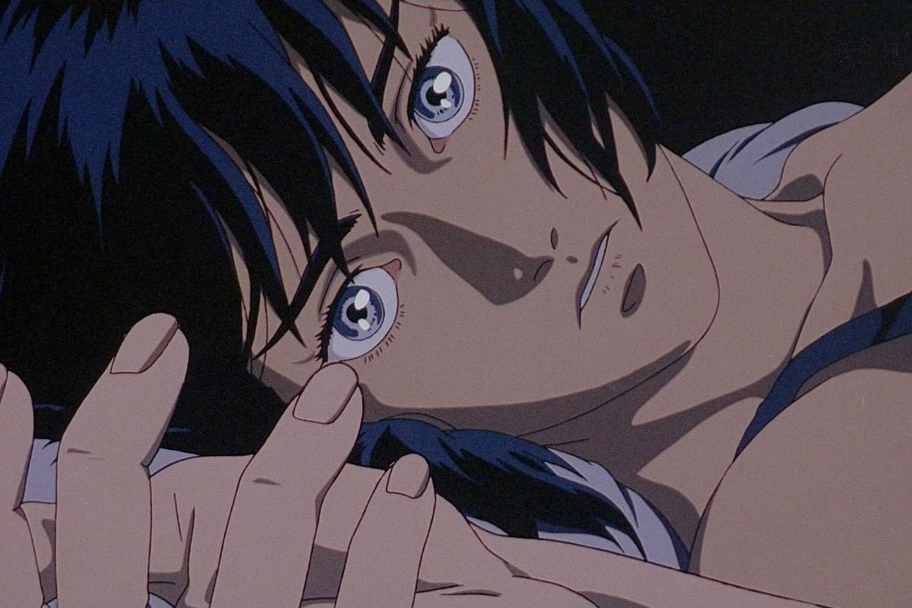
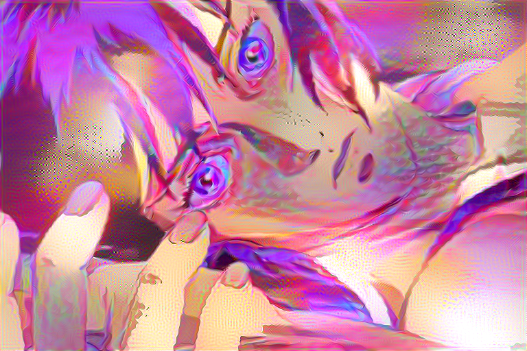
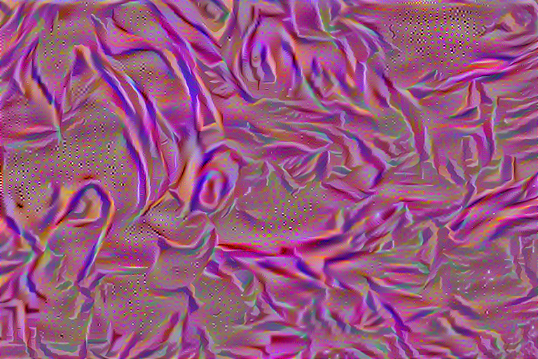

# Image Style Transfer Using CNNs

This is a Pytorch implementation of Gatys et al.'s [Image Style Transfer Using Convolutional Neural Networks](https://www.cv-foundation.org/openaccess/content_cvpr_2016/papers/Gatys_Image_Style_Transfer_CVPR_2016_paper.pdf).

The file for pre-trained model parameters is borrowed from Gatys's own [repo](https://github.com/leongatys/PytorchNeuralStyleTransfer) on the same topic, and  can be downloaded by running:
```
wget -c --no-check-certificate https://bethgelab.org/media/uploads/pytorch_models/vgg_conv.pth
```

## Example

Style Image |  Content Image
:----------:|:---------------:
 | 

L-BFGS Result |  Adam
:------------:|:---------------:
 | 
